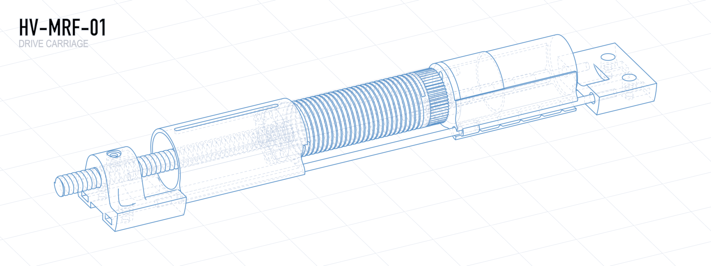

  <picture>
    <source media="(prefers-color-scheme: dark)" srcset="docs/images/carriage-hero-dark.png">
    
  </picture>

# HOPPVALS-MRF-01

**IKEA HOPPVALS Motorized Retrofit, version 01** (short: **HV-MRF-01**).

An open hardware + firmware project that motorizes an
[IKEA HOPPVALS][hoppvals] cellular (honeycomb) blind and exposes it to your
smart home as a standard **Zigbee 3.0 Window Covering** — so any compliant hub
(Home Assistant / ZHA, Zigbee2MQTT, deCONZ, SmartThings) can drive it with no
custom converters.

Two synchronized DC gearmotors wind the blind's lift cords onto grooved drums
to raise and lower the shade. A custom ESP32-C6 controller board fits inside
the head rail and runs the firmware in this repo.

> Status: work in progress — hardware and firmware are still under active
> development.

## Repository layout

| Path           | Contents                                                       |
| -------------- | -------------------------------------------------------------- |
| `firmware/`    | ESP32-C6 firmware (ESP-IDF, C++) — the Zigbee controller       |
| `electronics/` | KiCad schematic + PCB for the controller board                 |
| `mechanical/`  | Fusion 360 designs for the motor/drum/carriage assembly        |
| `docs/`        | Design write-ups, datasheets, schematic/PCB exports            |
| `tools/`       | Python scripts for bench diagnostics and motion tuning         |

## Documentation

- [`docs/DESIGN.md`](docs/DESIGN.md) — system design: mechanics, motion
  control, Zigbee behavior, and the reasoning behind it.
- [`docs/PCB_DESIGN_OVERVIEW.md`](docs/PCB_DESIGN_OVERVIEW.md) — a walkthrough
  of the controller PCB and its design decisions.

[hoppvals]: https://www.ikea.com/us/en/p/hoppvals-cellular-blind-white-70431402/
